# Front-end Project: E-commerce


This is the frontend for the Integrify Academy final full stack project. The full project description and backend code can be found [here](https://github.com/miraemilia/evergreen-fullstack).

The frontend mostly reuses the previous [frontend project](https://github.com/miraemilia/e-commerce/).

## Table of contents
- [Technologies](#technologies)
- [Features](#features)
- [Project overview](#project-overview)
- [Running the project](#running-the-project)
- [Deployment](#deployment)
- [Walk-through](#walk-through)

## Technologies

- Typescript
- React
- Redux toolkit (+ RTK query)
- Jest
- MUI
- SASS

## Project overview

### Folder structure

- vertical structure

````
.
├── README.md
├── readme_images
├── public
|
├── src
|   ├── index.tsx
|   ├── App.tsx
|   ├── app
|   |   ├── store.ts
|   |   ├ ...
|   ├── shared
|   |   ├ ...
|   ├── features
|       ├── products
|       |   ├ ...
|       ├── users
|       |   ├ ...
|       ├── credentials
|       |   ├ ...
|       ├── cart
|       |   ├ ...
|       ├── orders
|       |   ├ ...
|       ├── categories
|           ├ ...
├── .gitignore
├── .tsconfig
├── package.json
````

### Functions

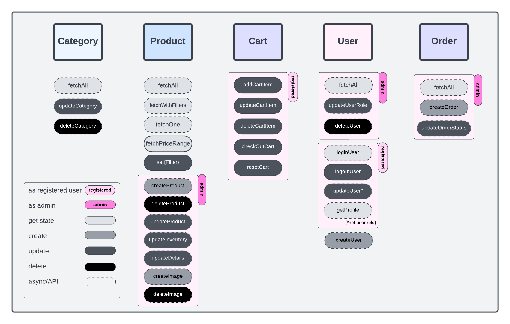

### Flowchart

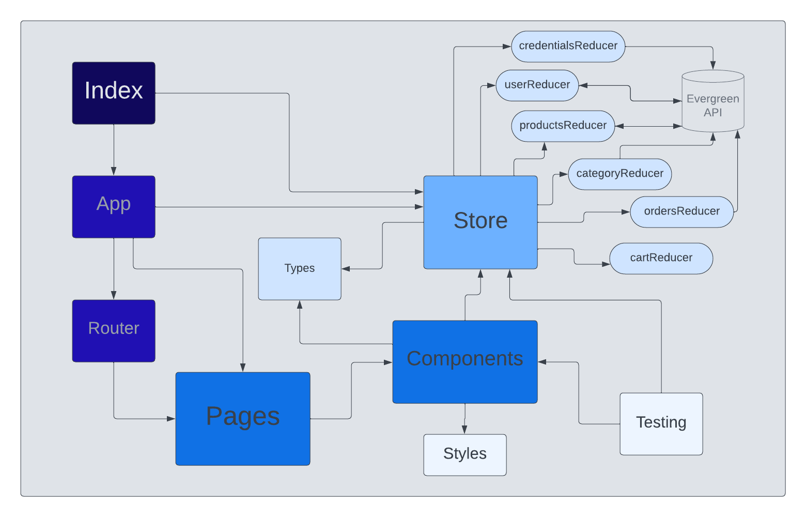

## Running the project

Requirements: Node

After cloning the project run `npm install` in project directory.

### `npm start`

Runs the app in the development mode.\
Open [http://localhost:3000](http://localhost:3000) to view it in the browser.

### `npm run test`

Launches the test runner in the interactive watch mode

## Deployment

Deployed with Netlify at [https://evergreenbotanics.netlify.app/](https://evergreenbotanics.netlify.app/)

## Walk-through

- [Front page](#front-page)
- [Products page](#products-page)
- [Logged in as customer](#logged-in-as-customer)
- [Logged in as admin](#logged-in-as-admin)

### Front page

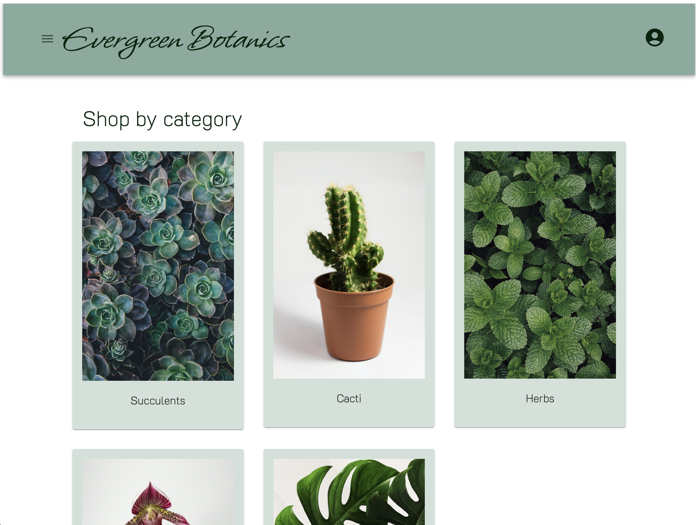

### Products page

#### Products by category
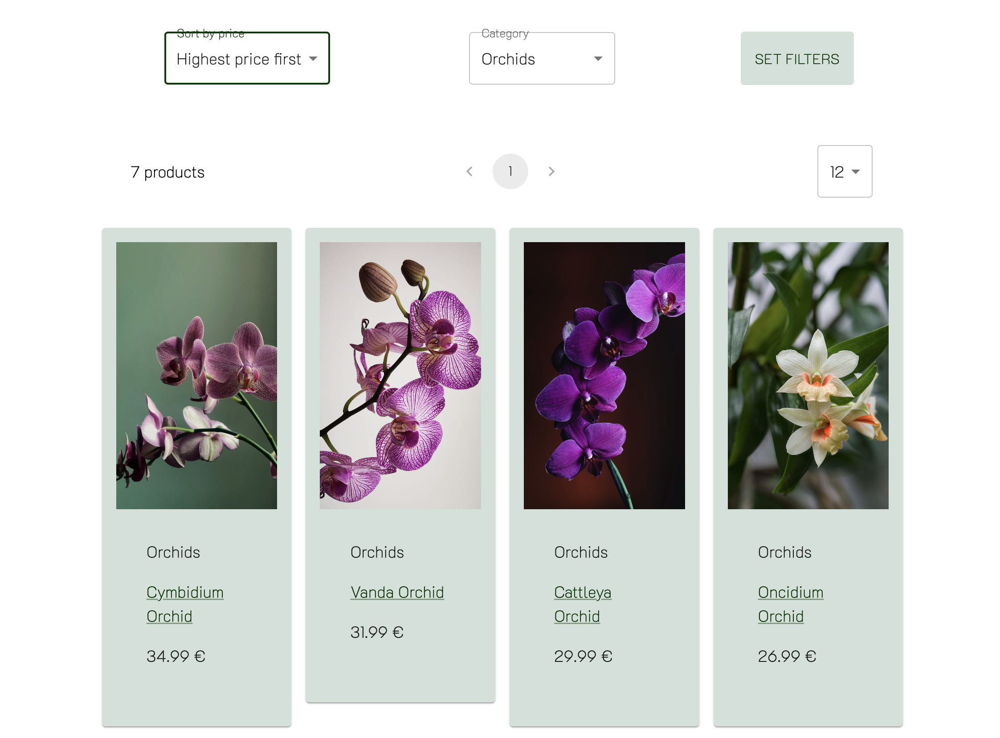
#### Filtering and sorting
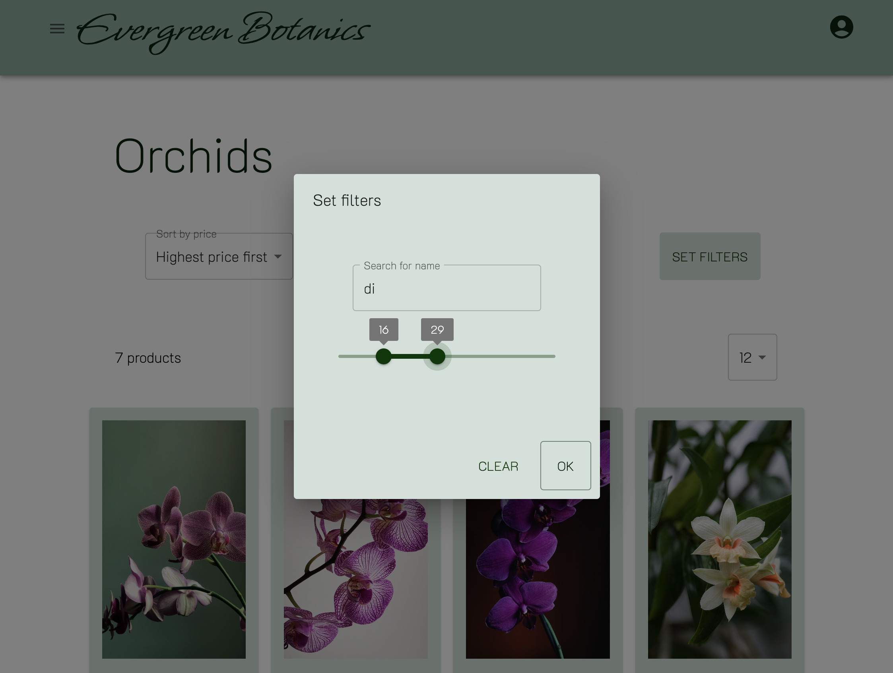
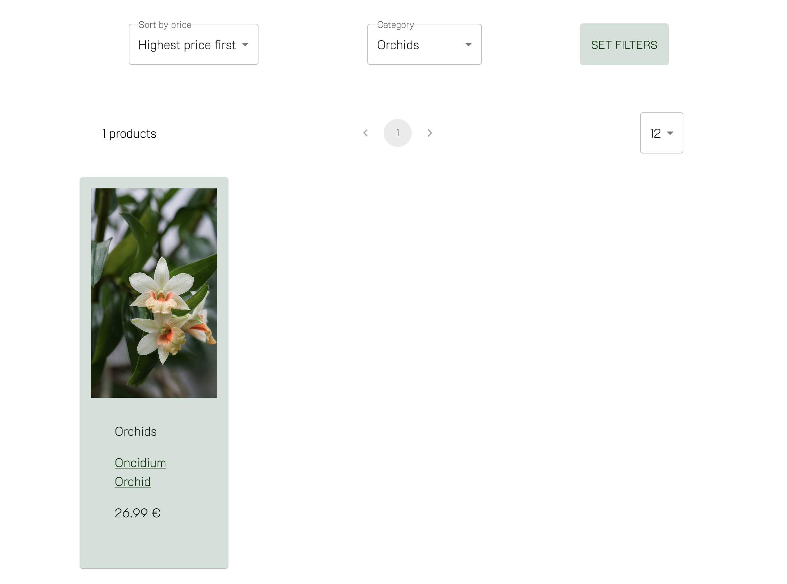

### Logged in as customer

#### Profile details and order history
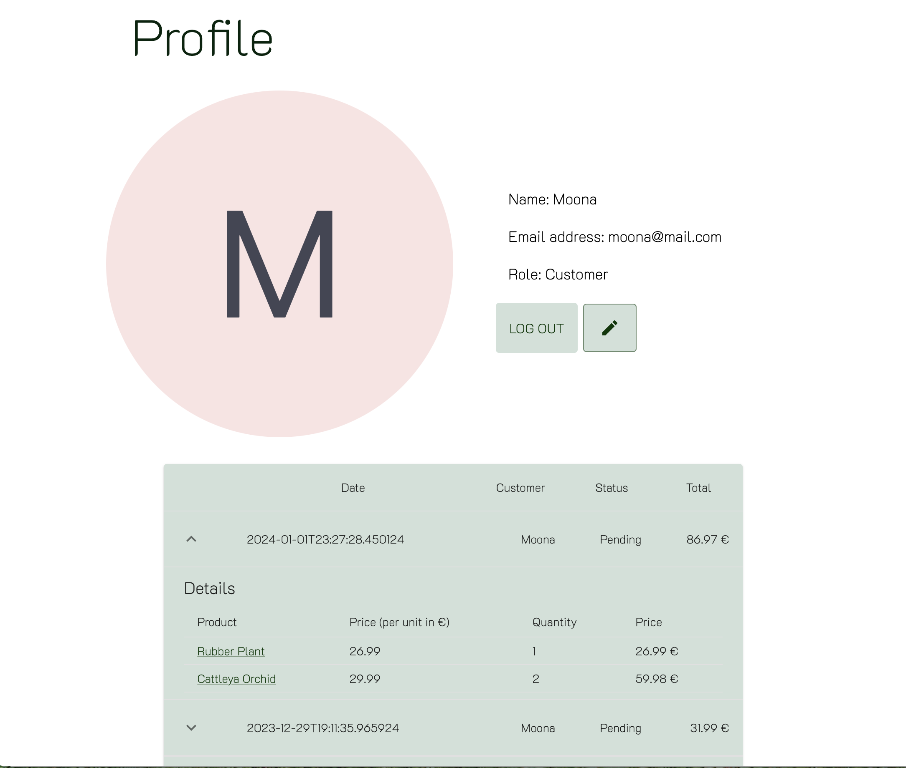
#### Shopping
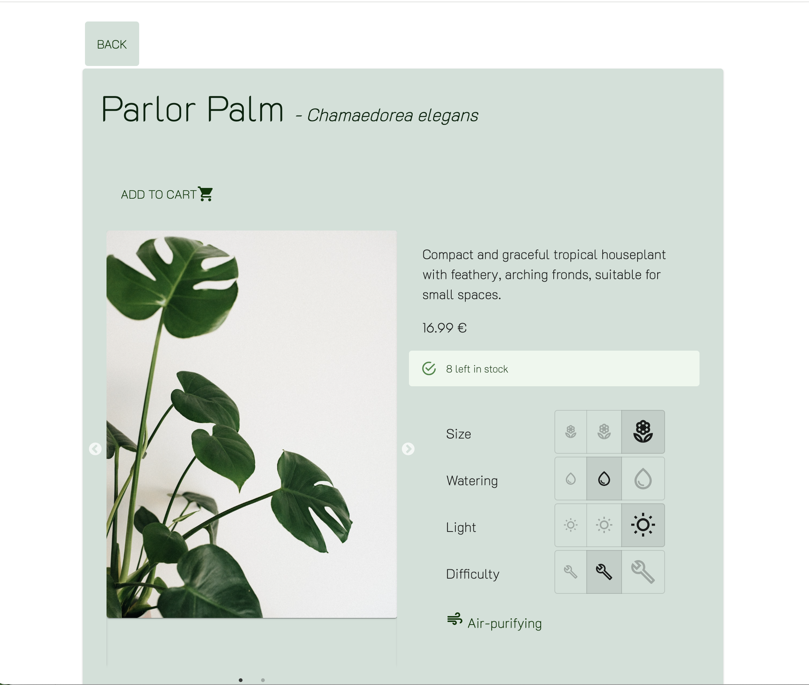
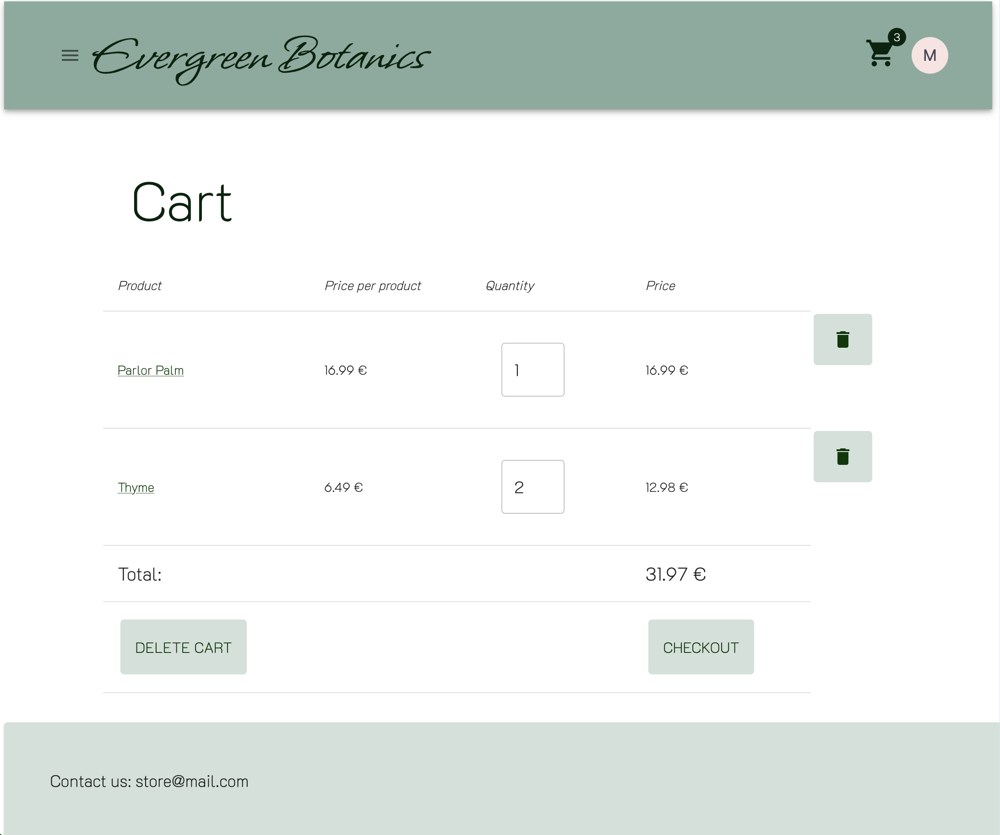


https://github.com/miraemilia/fs16_6-frontend-project/assets/80388217/8279eac5-fa36-4937-8789-da2240729134


### Logged in as admin

#### Admin dashboard
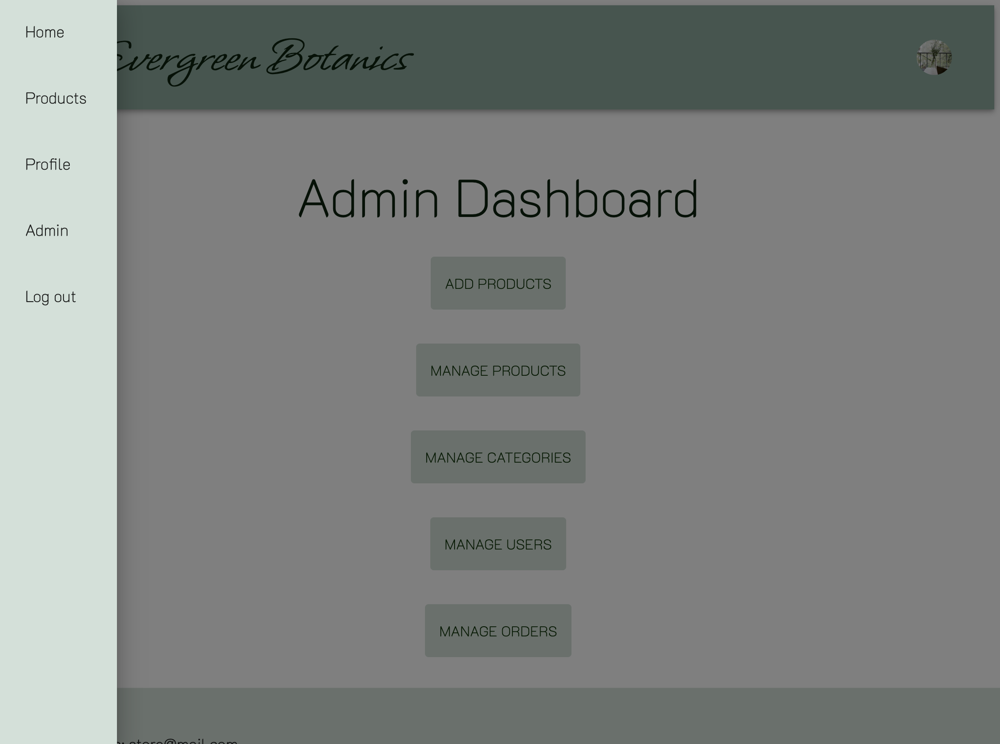

#### Example admin management page
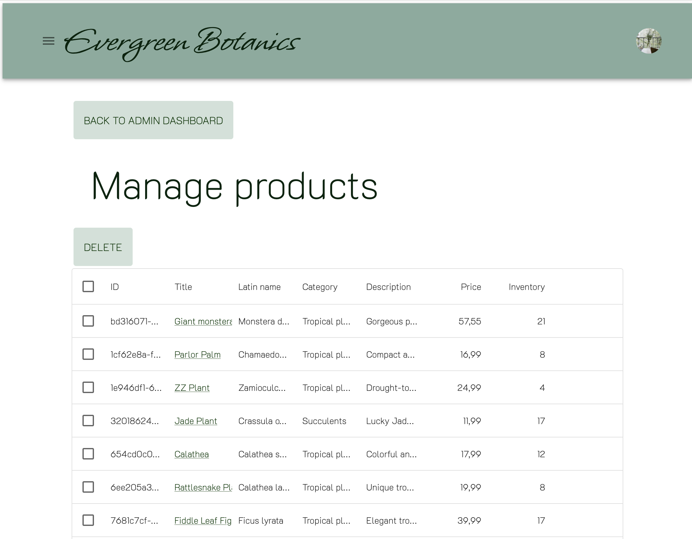
#### Product details update page
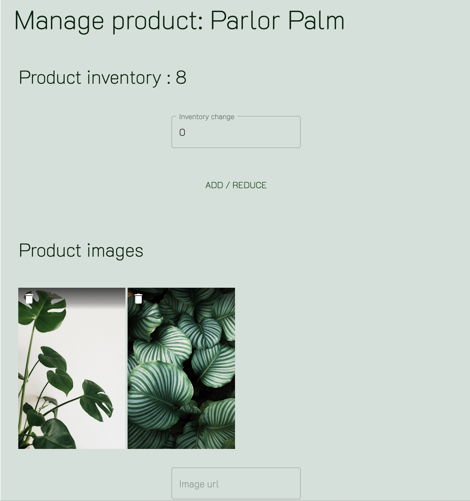
#### Recording

https://github.com/miraemilia/fs16_6-frontend-project/assets/80388217/44ffcf71-7105-43e1-b946-7d8792c4741a

