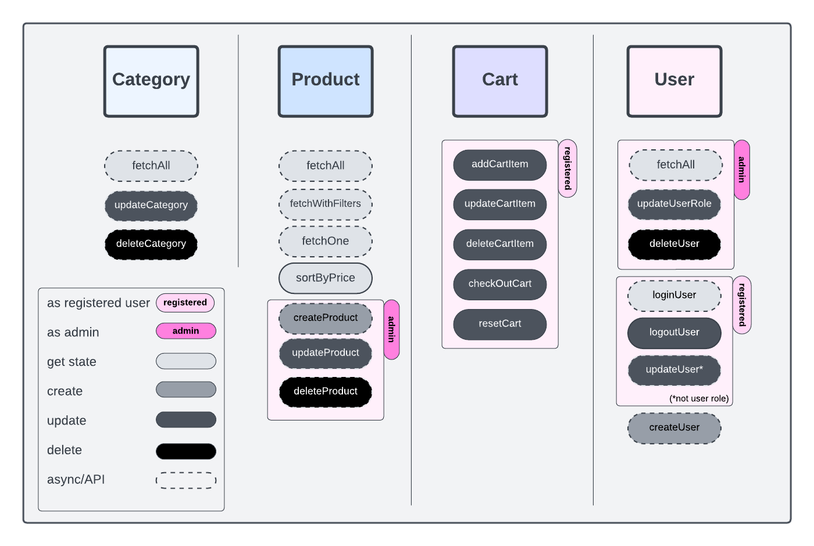
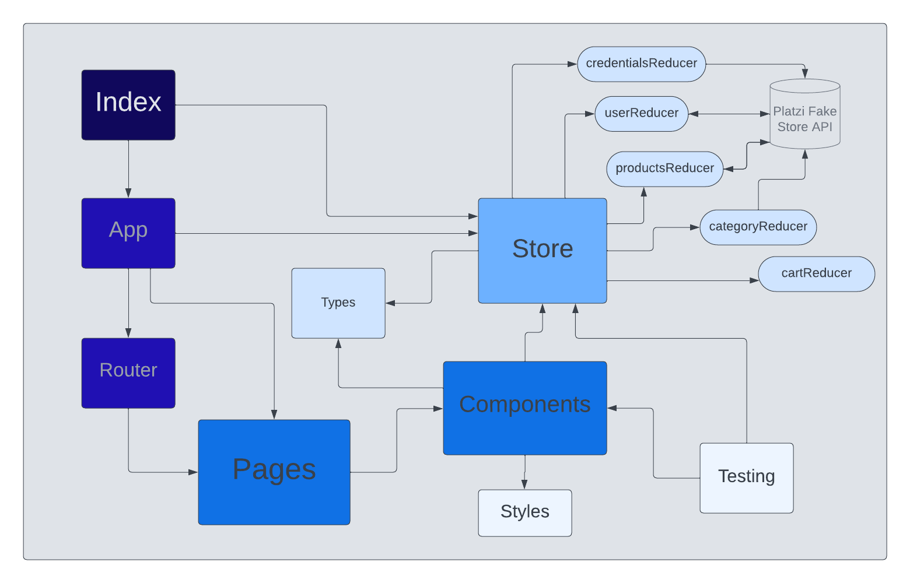

# Front-end Project: E-commerce


This is a project for the Integrify Academy Frontend module. The task was to create an e-commerce website using API endpoints from [https://fakeapi.platzi.com/](https://fakeapi.platzi.com/).

## Table of contents
- [Technologies](#technologies)
- [Features](#features)
- [Project overview](#project-overview)
- [Running the project](#running-the-project)
- [Deployment](#deployment)
- [To do](#to-do)

## Technologies

- Typescript
- React
- Redux toolkit
- RTK query
- Jest
- MUI
- SASS

## Features

(* optional feature: not explicitly mentioned in requirements)

### User (unregistered/not logged in)
- able to view all product listings (all or by category)
- able to sort(by price) and filter products
- able to view single product page
- able to register
- able to log in
	#### Logged in user
	- able to view own account details
	- *able to modify email, password, name and avatar(?) for self
	- able to log out
	- *able to delete account
	- able to create cart
	- able to update cart
	- able to check out cart
	#### Admin
  - able to modify products (create*, update, delete)
  - *able to view all users (all details but password)
  - *able to delete users
  - *able to modify user roles

### Product: 
  - can be viewed as list (all/by category)
	- can be viewed individually
	- can be sorted (by price)
	- can be filtered
  - can be added to cart(by logged in user)
	- can be created, modified and deleted (by admin)

### Category:
  - can be viewed as list

### Cart:
  - can be created
	- can be modified (add cart item, update cart item quantity, delete cart item)
	- can be checked out
	- can be deleted

## Project overview

### Folder structure

````
.
├── README.md
├── readme_images
├── public
|
├── src
|   ├── index.tsx
|   ├── App.tsx
|   ├── app
|   |   ├── store.ts
|   |   ├ ...
|   ├── shared
|   |   ├ ...
|   ├── features
|       ├── products
|       |   ├ ...
|       ├── users
|       |   ├ ...
|       ├── credentials
|       |   ├ ...
|       ├── cart
|       |   ├ ...
|       ├── categories
|           ├ ...
├── .gitignore
├── .tsconfig
├── package.json
````

### Functions

- needs to be updated



### Flowchart



## Running the project

Requirements: Node

After cloning the project run `npm install` in project directory.

### `npm start`

Runs the app in the development mode.\
Open [http://localhost:3000](http://localhost:3000) to view it in the browser.

### `npm test`

Launches the test runner in the interactive watch mode

## Deployment

## To do (final week)
- UI
	- [x] admin functionalities: delete, update
	- [ ] admin functionalities: create product
	- [x] add more content to profile and product page
	- [x] more header and footer elements
	- [x] shortcut buttons
	- [x] sorting
	- [x] filtering
	- [ ] better exception handling
	- [ ] ErrorPage
	- [x] cart checkout functionality
	- [x] styles
		- [ ] after profile logout
		- [ ] product card
		- [ ] products page mobile layout
		- [ ] filter button
		- [ ] cart
		- [ ] AppBar heading
- general
	- [ ] deployment
	- [ ] cleanup/lint
	- [ ] revise README
- optional
	- [ ] pagination
	- [ ] admin functionalities: manage users
	- [ ] component testing
